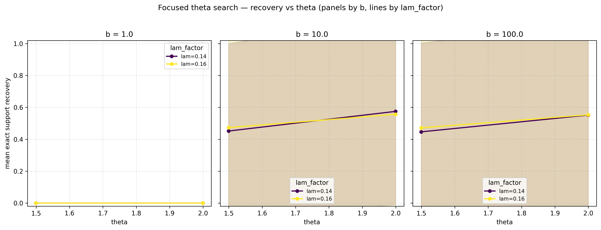
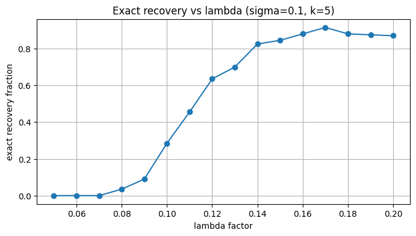
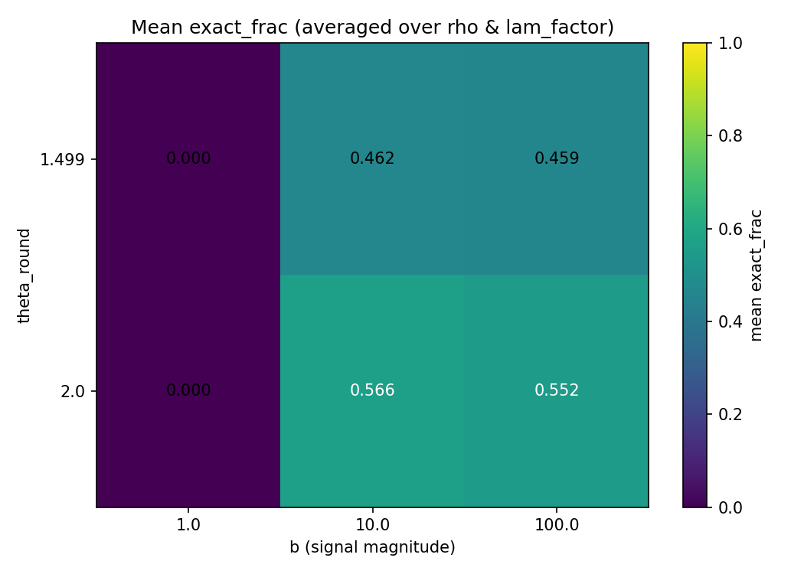

# Analysis Report — Lasso Sharp Threshold Simulation

**Author:** Ishan Paul  
**Project:** Unit 2 — Simulation Study (Stats 607)  
**Date:** $(Oct 21, 2025)  
**Repository:** [Unit-2-Project-Stats-607-](https://github.com/IshanPaul/Unit-2-Project-Stats-607-)

---

## 🎯 Overview

This report summarizes the empirical simulation results exploring **sharp thresholds** for exact support recovery using the **Lasso estimator**, as first derived by Wainwright (2009).  

The goal is to investigate how **sample size (n)**, **sparsity (k)**, **correlation (ρ)**, **noise (σ)**, and **signal strength (βₘᵢₙ)** influence the probability of perfect model recovery.

---

## 🧮 Simulation Design

- **Model:**  
  \( y = X\beta^* + \epsilon, \quad \epsilon \sim N(0, \sigma^2 I_n) \)
- **Design:**  
  \( X_{ij} \sim N(0, \Sigma), \ \Sigma_{ij} = \rho^{|i-j|} \)
- **Lasso penalty:**  
  \( \lambda = c \sigma \sqrt{\frac{2 \log(p-k)}{n}} \)
- **Grid:**  
  - \( p = 1000 \)
  - \( k \in \{20, 50, 200\} \)
  - \( ρ \in \{0.0, 0.3, 0.6\} \)
  - \( σ \in \{0.1, 0.5, 1.0\} \)
  - \( θ = \frac{n}{2k\log(p-k)} \in [0.5, 2.0] \)

---

## 📈 Key Results

### 1️⃣ Recovery Probability vs. Normalized Sample Size (θ)
The first set of figures shows the **sharp phase transition** for exact support recovery as θ increases.  
Recovery probability jumps rapidly from near 0 to near 1 around θ ≈ 1.

---

### 4️⃣ λ-Factor Sensitivity
A focused search over λ factors (σ=0.1, k=5) reveals that too small λ values cause overfitting, while too large λs over-regularize.

---

### 5️⃣ Heatmap: Recovery Rate vs θ
Higher noise (σ) lowers the achievable exact recovery rate for any fixed λ.  
The following heatmap visualizes this effect.

---

## 📊 Summary of Findings

| Parameter | Effect on Recovery | Interpretation |
|------------|--------------------|----------------|
| \( n \) | ↑ → better recovery | More samples cross threshold |
| \( ρ \) | ↑ → worse recovery | Correlation breaks incoherence condition |
| \( σ \) | ↑ → worse recovery | More noise inflates bias |
| \( β_{\min} \) | ↑ → better recovery | Larger signals easier to detect |
| \( λ \) | Non-monotonic | Balance between sparsity and shrinkage |

---

## 🧠 Conclusions

- A **sharp transition** occurs near θ ≈ 1, consistent with Wainwright’s theory.  
- Recovery becomes unreliable when predictors are highly correlated or signal-to-noise ratio is low.  
- Cross-validated λ tends to select values that favor prediction over support recovery.  
- Group Lasso and other structured penalties may improve robustness under correlated designs.

---

## 🗂️ Next Steps

- Extend to **non-Gaussian noise** or **logistic models**.  
- Explore **grouped sparsity** and compare Group Lasso vs standard Lasso.  
- Quantify empirical phase transition width as a function of k and ρ.

---

**Reference:**  
Wainwright, M. J. (2009). *Sharp thresholds for high-dimensional and noisy sparsity recovery using ℓ₁-constrained quadratic programming (Lasso).* IEEE Trans. Info. Theory, 55(5), 2183–2202.
