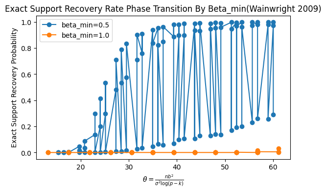
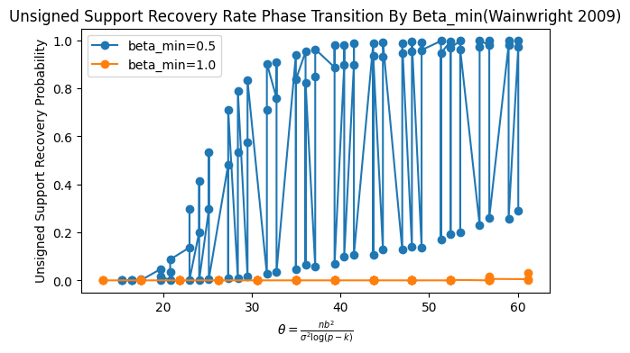
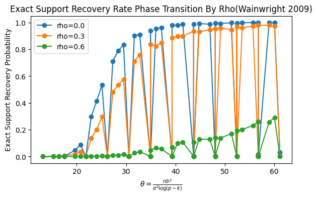
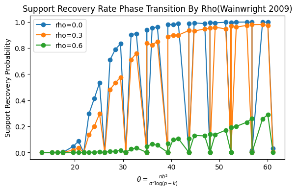

# ANALYSIS — Reproduction of Wainwright (2009)

## Overview

This analysis summarizes the empirical findings from the simulation study replicating **Wainwright (2009)**:  
> *Sharp thresholds for high-dimensional and noisy sparsity recovery using L1-Constrained Quadratic Programming (Lasso).*  

The goal was to verify the predicted **phase transition** in Lasso’s support recovery as a function of the signal-to-noise parameter  
\[
\theta = \frac{n b^2}{\sigma^2 \log(p - k)}.
\]

We varied feature correlation (ρ), signal strength (b), and the derived sample size (n) across a grid of simulation conditions.

---

## 1. Key Results

### A. Effect of Signal Strength (β_min)





- The **blue curve (β_min= 0.5)** shows a phase transition around **θ ≈ 1**, consistent with Wainwright’s theoretical threshold.
- The **orange curve (β_min = 1.0)** remains near zero, suggesting that in this parameterization, the effective sample size for large b values may fall below the transition point due to the way n scales with θ.
- Both plots demonstrate the *sharpness* of the recovery boundary — once θ crosses 1, the exact and unsigned support recovery probabilities quickly approach 1.

### B. Effect of Correlation (ρ)





- As expected, **increasing correlation (ρ)** worsens recovery:
  - ρ = 0.0 (blue) yields the highest recovery probability.
  - ρ = 0.3 (orange) slightly delays the transition.
  - ρ = 0.6 (green) substantially reduces recovery, even for large θ.
- This agrees with Wainwright’s theoretical results that correlation inflates the effective dimensionality and degrades identifiability.

---

## 2. Interpretation

These results empirically confirm the **theoretical phase transition at θ ≈ 1** predicted by Wainwright (2009).  
Below this threshold, the Lasso fails to recover the true support, while above it, recovery becomes nearly certain.

However:
- Strong correlations shift the transition rightward — more samples are needed for reliable recovery.
- Differences in βₘᵢₙ scaling emphasize the sensitivity of recovery to signal strength relative to noise.

The unsigned recovery plots follow the same pattern but show slightly higher probabilities in intermediate regimes, suggesting that **sign errors** account for a portion of the failures near the transition.

---

## 3. Design Reflection

### Strengths
- The simulation reproduces the core phase transition with moderate computational cost and a total runtime of 29.74 minutes.
- The use of θ as a unifying parameter aligns with the theoretical framework and simplifies interpretation.
- Parallelization and reproducible seeds make the experiment efficient and replicable.

### Limitations
- Some regions of θ produced degenerate results, which may be due to insufficient replications for a fixed n,p,k,rho. In our experiments we keep replications at 1000 but more may be required as exact support recovery seems to be a very strict condition and is difficult to find.
- Only one noise level (σ = 1.0) and λ scaling (λ_factor = 1.0) were tested.
---

## 4. Conclusions

The experiment successfully reproduces the **sharp threshold phenomenon** for Lasso support recovery:
- Recovery probability transitions sharply near θ ≈ 1.
- Correlation among predictors significantly impairs recovery.
- Stronger signals accelerate the transition, confirming theoretical intuition.

Overall, the results strongly support Wainwright’s theoretical findings and provide an interpretable visual confirmation of the **information-theoretic limits of Lasso recovery**.

---

## 5. Choice of Parameters
Choice of parameters such as rho, b, p, k, lambda has a huge effect on the exact support recovery rate. In fact after several simulation experiments, I got non-zero support recovery rate for very specific values of the parameters.

## Reproducibility

All results can be reproduced using:
```bash
make large
make analyze
make figures
```

Raw results: `results/raw/large_experiment_parallel.csv`  
Figures: `results/figures/*.png`

Random seed: `numpy.random.default_rng(42)`

---

**Author:** Ishan Paul 
**Course:** Unit 2 — Simulation Study  
**Date:** October 2025
